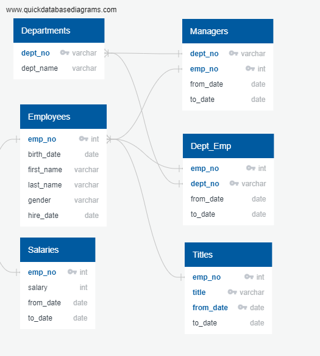
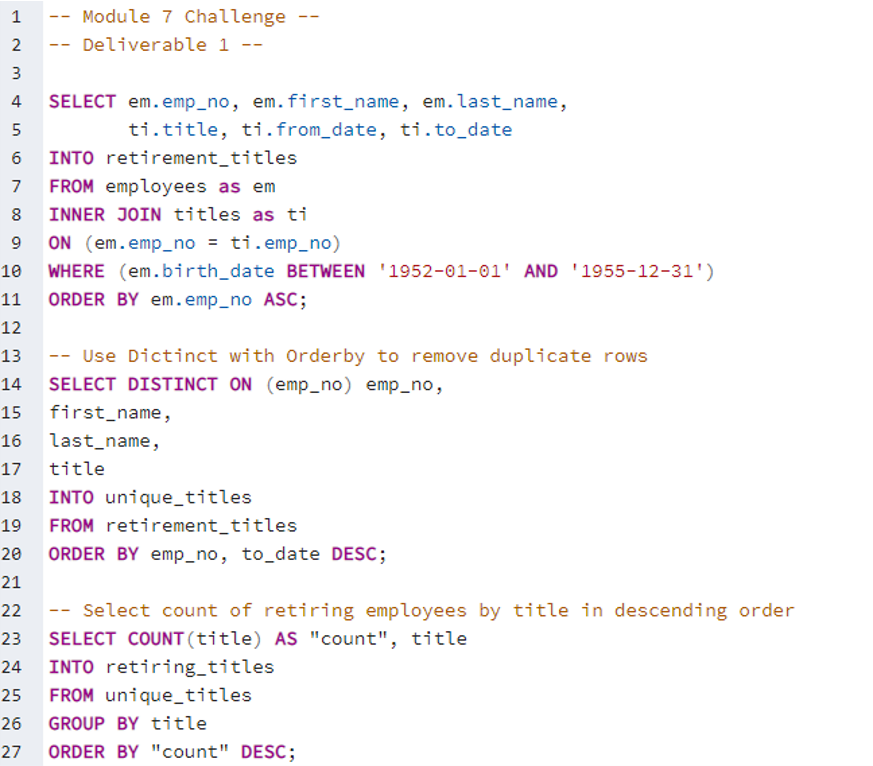
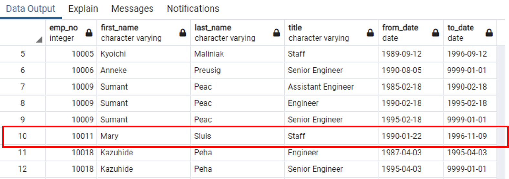
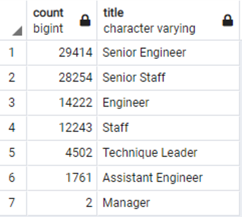
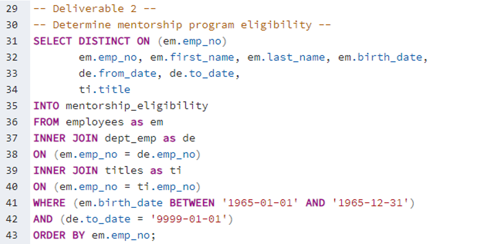
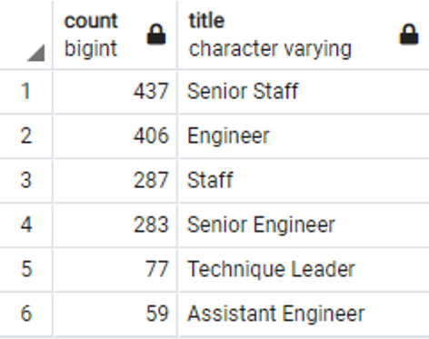

# Pewlett Hackard Analysis

## Pewlett Hackard Analysis Overview

In this project, an SQL database was created and queried to help an HR analyst for Pewlett Hackard determine the number of employees who will be retiring in the relatively near future. The employees were filtered by age and longetivity with the company to determine eligibility for retirement packages. The employees were further filtered by departments and titles to help plan for specific roles to fill. To further plan for the wave of retirements, a query was written to determine eligibility for current employees to participate in a mentorship program based on employee age. The databases were created and queries were developed using pgAdmin 4 in PostgreSQL 12.

### Pewlett Hackard Analysis Purpose

The overall purpose of this challenge was to introduce students to SQL through PostgreSQL and pgAdmin. Students gained experience creating databases from CSV files and writing queries to search and create tables.

## Pewlett Hackard Analysis Results

The entity relationship diagram (ERD) for this database is shown in Fig. 1, and the list below summarizes the analysis results.

*Figure 1. ERD for Pewlett Hackard employee database*

- The way the query is currently written, there is nothing to ensure all employees in the analysis for deliverable 1 currently work for Pewlett Hackard as shown by the query code in Fig. 2 and the table in Fig. 3. As a result, the data captures some employees who are no longer with Pewlett Hackard errouneously increasing the total count of employees who are nearing retirement eligibility. In order to fix this, there should be a WHERE statement that limits the retirement-ready employees to those who currently work at the company. This could be accomplished by filtering where "to_date = '9999-01-01'".

*Figure 2. Query code to determine retirement-ready employees*

*Figure 3. Retirement-ready employees determined by the query in Fig. 2*

- Another challenge with the data is that it contains duplicate entries for employees due to changes in title throughout the employees' tenure with the company. Therefore, the DISTINCT ON () clause is used to return a single entry for each employee based on the employee number. Unfortunately, the data is not structured so that the most recent title is listed first for each employee. Therefore, when the DISTINCT ON () clause is used, there is no guarantee that it grabs the current title because the DISTINCT ON () clause finds the first row containing duplicate employee numbers. As a result, there is no guarantee that the data is accurate for the breakdown of retiring employees by title, and the HR staff could be given misguided direction in terms of future hiring.

- According to the analysis, a significant number of employees will be retiring in the near future.Furthermore, a large number of retiring employees will be senior level engineers and staff as shwon in Fig. 4. This could be especially problematic for engineering positions as many senior level engineers tend to specialize in a small number of areas. Depending on the specialization, it could be very difficult to find engineering positions to fill certain roles. On the other hand, very few managerial level employees will be retiring in the near future indicating no real to company management in terms of staffing.

*Figure 4. Breakdown of employees nearing retirement by title*

- A table was also generated for current employees who are eligible for a mentorship program using the query shown in Fig. 5. The employees were filtered based on their age to determine eligibility. As a further step, the eligible employees were also grouped by title to determine the number of employees in each title eligible for the program as shown in Fig. 6. It is clear from Figs. 4 and 6 that there should be enough retiring employees of corresponding titles to train those eligible for the mentorship program and hopefully avoid a major skills gap when employees retire. 

*Figure 5. Query code to determine employees eligible for a mentorship program*

*Figure 6. Breakdown of employees eligible for a mentorship program by title*

## Pewlett Hackard Analysis Summary

According to Fig. 4, a total of 90,398 roles will eventually need to be filled as eligible employees retire according to this analysis. Recall, however, that this number is not filtered by employees currently employed with Pewlett Hackard, so the data could be skewed. Fortunately, there are more than enough retirement-ready employees to mentor those eligible for the mentorship program. One note of caution, however, is that the number of retiring employees significantly exceeds the number of those eligible for the mentorship program shown in Fig. 6. This could indicate an upcoming skills gap when retirement-ready employees begin to retire.

In addition to limiting the retiring employees only to those currently with Pewlett Hackard as mentioned above, another useful query/table would be one that further breaks down the employees by job function or specialization. In particular, engineers tend to specialize later in their careers, so the senior engineers likely have specialties in one or more areas.

In an extension of the previous query, the candidate employees for the mentorship program could be broken down by specialization, particularly for engineering roles. This would show Pewlett Hackard if there are skills gaps within the company that will be exacerbated by retiring employees. As a result, Pewlett Hackard could begin to take action now to either train employees for particular specializations or look for outside candidates that could be brought in to fill specialized roles.